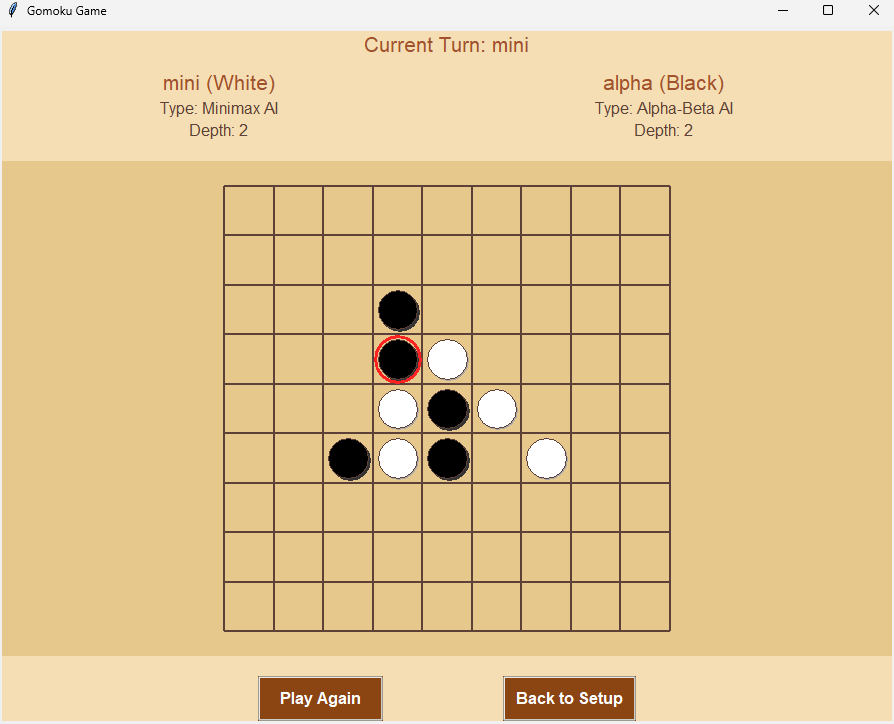

# Gomoku Game (Python + Tkinter + AI)

A full-featured Gomoku (Five in a Row) game written in Python with a graphical user interface using Tkinter, sound effects with Pygame, and AI opponents powered by Minimax and Alpha-Beta pruning.

---

## 🎯 Objective

Gomoku is a strategic board game where the goal is to place five of your pieces in a row before your opponent. The alignment can be horizontal, vertical, or diagonal.

---

## 📦 Features

### 🧠 AI Players
- **Minimax AI**: Explores the game tree up to a set depth to choose the best move.
- **Alpha-Beta AI**: Optimized version of Minimax using alpha-beta pruning for faster decision-making.
- AI difficulty can be customized via depth setting.

### 🧑‍🤝‍🧑 Player Modes
- Human vs Human
- Human vs AI (Minimax or Alpha-Beta)
- AI vs AI

### 🧩 Game Configuration
- Selectable board size from **5x5 to 19x19**
- Name input for both players
- Player type and depth selection for AI

### 🖼️ GUI Features
- Modern styled setup and gameplay windows
- Click to play (for humans)
- Highlighted last move and win sequence

### 🔊 Sound Effects
- Click sound on move placement
- Win sound on game end

### ♻️ Replayability
- Restart game button
- Back to setup for new configurations

---

## 🛠️ Installation

Ensure you have Python 3.x installed.

Install required packages:

```bash
pip install pygame numpy
```

---

## ▶️ How to Run

1. Download or clone the repository.
2. Navigate to the project directory.
3. Run the game:

```bash
python Gomoku.py
```

---

## 🎮 How to Play

1. Launch the application.
2. Set the board size and player types.
3. Click **"Start Game"** to begin.
4. Human players use mouse clicks to place stones.
5. The game ends when a player aligns 5 pieces or the board fills up (draw).

---

## 📸 Screenshots



---

## 📖 Rules of Gomoku

- Players alternate placing a stone on an empty cell.
- The first player to get five in a row wins.
- The game ends in a draw if the board fills with no winner.

---
